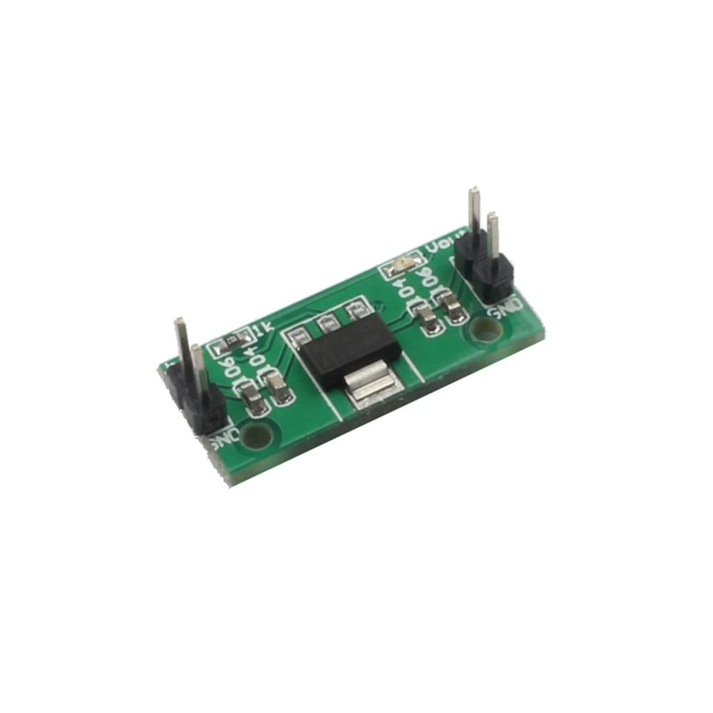
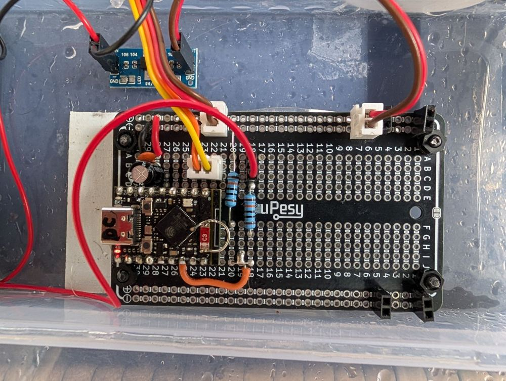
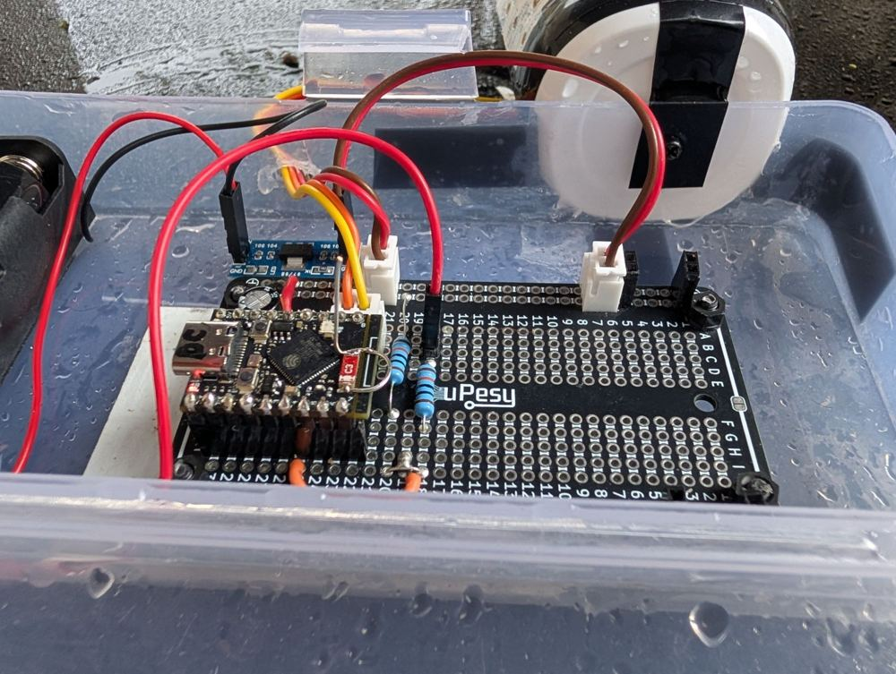
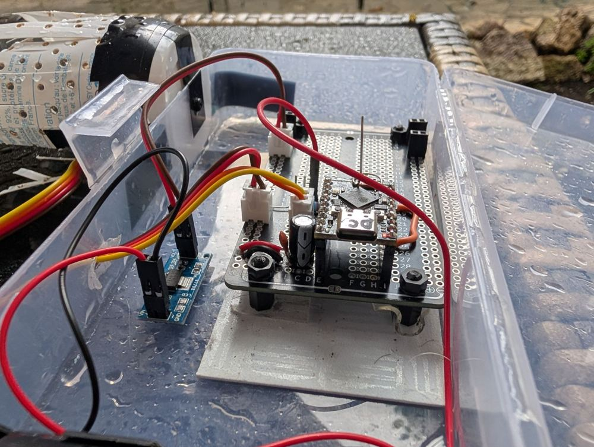
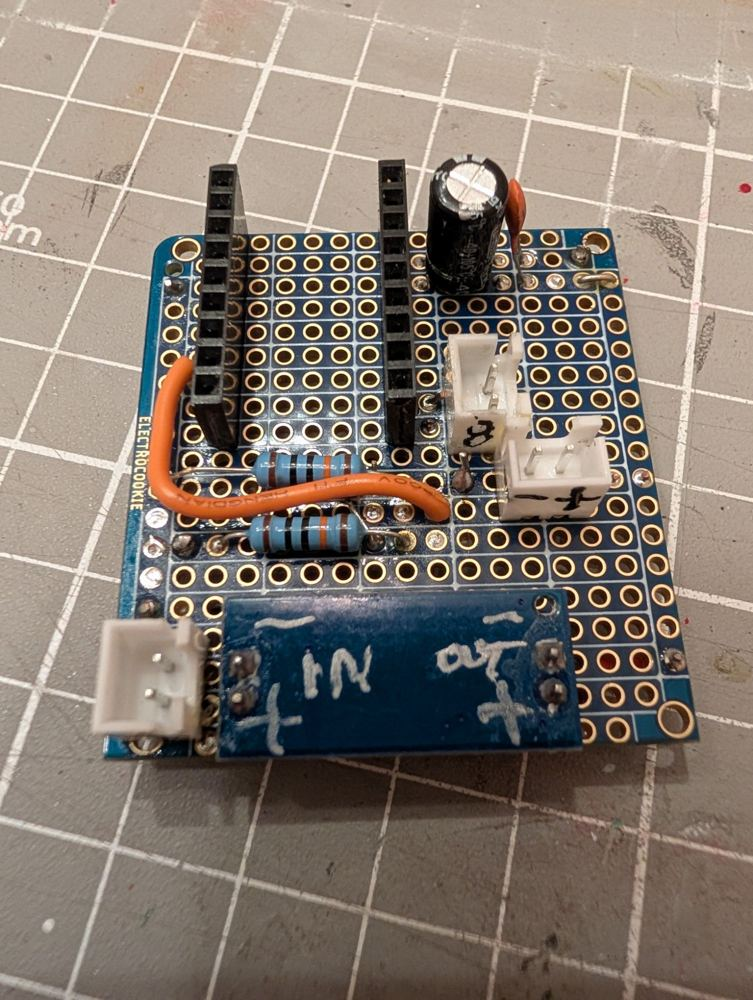
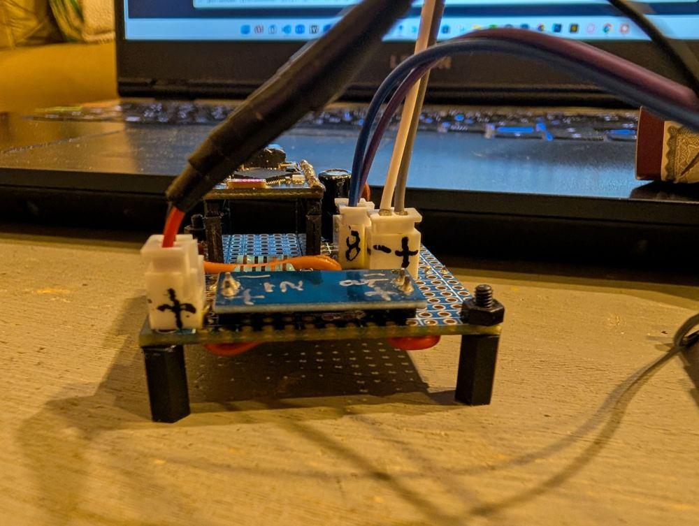
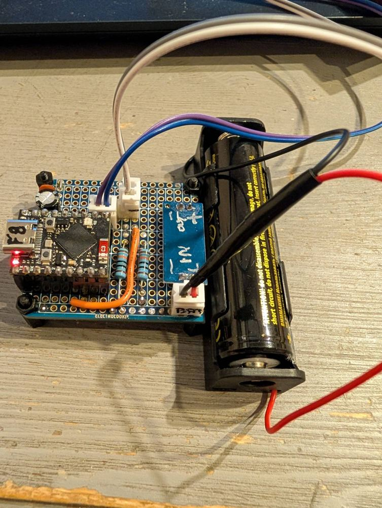
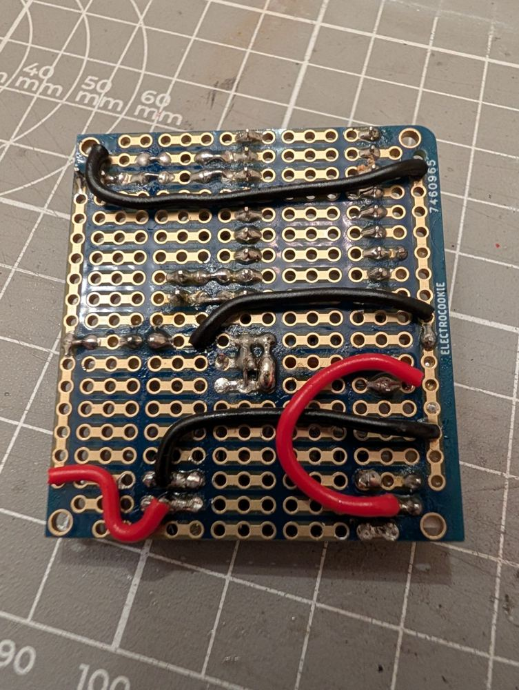

# Câblage et fonctionnement - MeteoHubSensor

Sonde météo extérieure autonome, reliée à la station **MeteoHub** par **ESP-NOW**.
Carte cible : **ESP32-S3 Super Mini** (`sonde-supermini`) - LED RGB seule (pas d'écran,
pour réduire la consommation), TX ESP-NOW plafonnée (11 dBm).

> La liaison est un **unicast** vers la MAC du hub : chaque envoi reçoit un accusé
> de réception matériel (ACK). La carte plafonne sa puissance d'émission (l'antenne
> PCB du Super Mini est mal adaptée : à pleine puissance, le hub n'acquitte pas).
> Le niveau se règle dans `include/config.h`.
> Antenne filaire essayée en prod depuis le 2026-10-06 : voir `docs/notes.md`, section 5.

Le brochage vit dans `include/board_config.h` (sélectionné par `SENSOR_BOARD_S3`) et
les réglages dans `include/config.h`.

---

## 1. Brochage - ESP32-S3 Super Mini

USB natif sur GPIO 19/20. BOOT sur GPIO 0. Straps 45/46 (GP46 input-only).

| Broche | GPIO | Usage firmware |
| :--- | :--- | :--- |
| **3V3** | -- | Alim capteurs I2C |
| **GND** | -- | Masse |
| **GP8** | 8 | I2C **SDA** (AHT20 / BMP280) |
| **GP9** | 9 | I2C **SCL** |
| **GP48** | 48 | LED RGB **WS2812** onboard (pas GP46) |
| **GP0** | 0 | Bouton **BOOT** |
| **GP4** | 4 | ADC batterie (`PIN_BATTERY_ADC = 4`) : pont 100k/100k depuis le **+ accu** (avant le régulateur 3,3 V) |
| **GP1** | 1 | DHT22 DATA (humidité prioritaire, repli AHT20) |
| **GP2** | 2 | Girouette ADC (réserve) |
| **GP7** | 7 | Pluviomètre (réserve) |
| **GP10** | 10 | ADC auxiliaire (réserve) |
| **GP5** | 5 | Anémomètre (réserve) |
| **GP6** | 6 | Libre |

- **Pas d'écran** : le statut passe par la LED RGB et le log USB CDC.
- **TX ESP-NOW plafonnée à 11 dBm** : à pleine puissance, le hub n'acquitte aucune
  trame (antenne PCB du Super Mini mal adaptée). Réglable via le menu de `config.h`
  (`SENSOR_TX_POWER_LEVEL` ; la carte le demande via `SENSOR_NEEDS_TX_LIMIT`).
- La LED RGB onboard est sur **GPIO 48**. Le pinout constructeur annote parfois
  DIN WS2812 = GP46 : sur ESP32-S3, GP46 ne peut pas la piloter. Si la LED reste
  éteinte après flash, tester GPIO 47 (certains clones Lolin).

---

## 2. Capteurs I2C

```
Carte                     Capteur AHT20 / BMP280
┌──────────┐              ┌─────────────────────┐
│      3V3 ├─────────────►│ VCC (3.3V)          │
│      GND ├─────────────►│ GND                 │
│  SDA     ├─────────────►│ SDA                 │
│  SCL     ├─────────────►│ SCL                 │
└──────────┘              └─────────────────────┘
```

- SDA/SCL : **GP8/GP9**.
- Adresses : AHT20 = 0x38, BMP280/BME280 = 0x76 ou 0x77.
- Pull-up I2C : la plupart des modules AHT/BMP les intègrent ; sinon 4,7 kΩ vers 3V3.

---

## 3. Alimentation batterie

**Module régulateur 3,3 V + accu Li-ion** (cellule 3,7 V, 3000 mAh depuis le 2026-10-03).
Un petit module **Youmi « 3.3 V DC/DC abaisseur »** (boîtier SOT-223, une LED sur la sortie,
bornes IN + GND et OUT + GND en 2 broches, 26 x 12 x 12 mm) abaisse la tension de l'accu en un
**3,3 V** pour la carte. Annoncé par le vendeur : entrée **4,5 à 7 V CC**, sortie 3,3 V CC,
800 mA. Le
même module équipe la v1 (prod) et la v2 (banc), voir la section 5.



Câblage du module, identique sur la v1 et la v2 : l'**accu** est branché sur **VIN et GND** du
régulateur ; le module distribue le **3,3 V** (VOUT) et la **masse** (GND) à la carte.

Il remplace le module **Breadvolt** (boost AP2004H) des premières versions, qui semblait
décrocher à la charge très faible du deep sleep (voir l'essai light sleep dans
`include/config.h`). Le Breadvolt n'est plus monté sur la carte de prod.

**Charge de l'accu.** Le Breadvolt gérait lui-même l'accu (protection décharge 2,4 V, charge
4,28 V, LEDs CHG/PWR). Ce n'est plus le cas : le module régulateur ne fait ni charge ni
protection. L'accu est chargé **hors de la sonde, dans un chargeur de bureau** ; il n'y a **pas de
charge par USB** dans cette version. L'usage visé est de disposer de **deux accus** et de
remplacer l'accu usé par l'accu chargé quand c'est nécessaire.

> **Point de vigilance (à mesurer)** : la plage d'entrée annoncée du module (4,5 à 7 V) est
> **au-dessus** de celle d'un accu Li-ion (2,6 à 4,2 V). Hors plage, la sortie n'est plus un 3,3 V
> régulé : elle suit l'accu, diminuée de la tension de déchet (dropout) du régulateur. Le S3
> décroche alors bien avant que l'accu soit vide (brownout vers 2,4 à 3,0 V de rail). Mesurer
> VOUT en fonction de la tension d'accu, sur le banc, pour connaître l'accu minimal utilisable et
> le comparer aux seuils d'alerte de MeteoHub (3,40 V puis 3,20 V).

- Le 3,3 V régulé est **constant** : le mesurer ne dirait rien de l'accu. On tape donc
  la **cellule**, **avant** le régulateur, au **+ accu** (multimètre ~4,0 V en charge).
- Cet accu monte à **4,28 V** en pleine charge : il ne doit **jamais** arriver brut sur
  la pin (limite ADC du S3 ~3,3 V). Un **pont 100 kΩ / 100 kΩ** divise la tension par
  deux et GP4 lit le point milieu :

  ```
  + accu ──[R1 100k]──┬── GP4 (ADC1)
                      │
                   [R2 100k]
                      │
                     GND
  ```

  GP4 voit ~2,0 V pour 4,0 V accu ; le firmware remultiplie par le ratio du pont
  (`BATTERY_DIVIDER_RATIO = 2,0`) et convertit en pourcentage par une **courbe de charge Li-ion par paliers**
  (`include/battery_curve.h`, testée par `pio test -e native`), pas par une droite : à 3,7 V
  il reste ~15 %, pas 69 %.
  `PIN_BATTERY_ADC = 4` (activé le 2026-09-15).
- Le pont draine en continu ~4,0 V / 200 kΩ ≈ **20 µA**, négligeable devant les
  réveils d'émission.
- **Accu actuel (2026-10-03)** : Li-ion 3,7 V **3000 mAh** (remplace le 14500 de 500 mAh).
- **Calibration fine** : si la tension rapportée par la sonde diffère de
  ton multimètre (tolérance des résistances + offset ADC), poser
  `BATTERY_VREF_CALIBRATION = tension_multimètre / tension_rapportée` (× facteur actuel) dans
  `board_config.h`. **Posé le 2026-10-03 : 1,036** (moyenne de deux relevés multimètre / sonde : 3,927 V pour 3,98 V et 4,074 V pour 4,14 V ; résidu < 0,3 %). À revérifier à pleine charge stable et à mi-charge.
- Filet de sécurité : quand l'accu se vide, le pourcentage tombe à 0 % (0 % calé à
  2,6 V, **seuil confirmé**, 0,2 V au-dessus de l'ancienne coupure 2,4 V du Breadvolt), puis la
  sonde s'arrête (MeteoHub voit **OUT absent**). Voir le point de vigilance ci-dessus : le rail 3,3 V
  peut décrocher avant que l'accu atteigne ce seuil.

---

## 4. LED de statut (WS2812 / NeoPixel)

La carte porte **une LED RGB adressable WS2812** (NeoPixel), pas une simple LED. Le
firmware l'utilise comme **témoin d'activité et de résultat d'émission**, en luminosité
douce (pour ne pas éblouir de nuit ni trop consommer). Il n'y a **pas d'écran** : cette
LED est le seul retour visuel local.

| Couleur | Quand | Signification |
| :--- | :--- | :--- |
| 🔵 **Bleu** | Au démarrage, puis pendant **chaque acquisition** de mesure | « Je travaille » : lecture des capteurs et préparation de la trame en cours |
| 🟢 **Vert** (bref) | Juste après l'envoi ESP-NOW, si le hub a **accusé réception** | La trame est **livrée** (ACK reçu du hub) |
| 🔴 **Rouge** (bref) | Juste après l'envoi ESP-NOW, si **aucun ACK** n'est revenu | La trame **n'a pas été livrée** (hub hors de portée / éteint) |
| 🔴 **Rouge fixe** | Au boot, si l'init ESP-NOW échoue | Radio ESP-NOW indisponible (défaut au démarrage) |
| 🔵 **Bleu fixe** | Après ~3 s d'appui sur **BOOT** | Relâcher : l'appairage démarre au relâchement (recherche d'un hub, 60 s max). Au-delà de 10 s d'appui, rien ne se passe (bouton coincé) |
| 🟢 **3 éclairs verts** | Fin d'appairage | Nouveau hub enregistré, mesures redirigées vers lui |
| 🔴 **3 éclairs rouges** | Fin d'appairage | Aucun hub, plusieurs hubs, ou pas d'accusé : **association inchangée** |
| ⚫ **Éteinte** | Au repos entre deux mesures (et avant la mise en veille) | Rien à signaler / cycle terminé |

Précisions importantes :

- **Vert = trame réellement livrée.** L'envoi est un **unicast** vers la MAC du hub :
  la couche radio renvoie un ACK matériel. Le vert confirme donc que MeteoHub a bien
  reçu la trame (et non seulement qu'elle est partie) ; le rouge signale l'absence
  d'ACK (hub éteint, hors de portée, ou mauvais canal).
- Le clignotement vert/rouge est **court** (~60 ms) : à chaque cycle de mesure
  (5 min par défaut), on voit un bref éclat, puis la LED s'éteint.
- En **mode veille profonde** (si activé), la LED est éteinte avant le sommeil pour ne
  rien consommer ; chaque réveil rejoue la séquence bleu → vert/rouge.

Le pilotage est dans `src/modules/power_manager.cpp` (`setLedColor`, `blinkStatus`,
`turnOffLed`), déclenché depuis `src/main.cpp`.

---

## 5. Cartes v1 et v2

Deux platines à bandes portent le même montage : un ESP32-S3 Super Mini sur barrettes
femelles, le module régulateur 3,3 V, le pont de mesure de batterie (100 kΩ / 100 kΩ vers GP4),
un condensateur électrolytique et une céramique près de l'alimentation, et **trois prises JST**
(accu, signaux I2C, alimentation du capteur).

### v1 : platine uPesy, sonde de production (boîtier extérieur)





- Platine noire **uPesy**, grand format, dans un boîtier transparent.
- Les **4 supports Dupont 2 broches** de la carte accueillaient le **Breadvolt**, retiré depuis.
- Le **module régulateur** n'est pas sur ces supports : sa **sortie** se branche sur le **JST voisin**
  de ces supports, sur le **rail d'alimentation** de la carte ; son entrée (VIN, GND) reçoit l'accu.
- Le S3 Super Mini porte l'**antenne filaire maison** (voir `docs/notes.md`, section 5).
- Les deux résistances de 100 kΩ et un fil orange vers la broche GP4 forment le pont de mesure.

### v2 : platine Electrocookie, banc






- Platine bleue **Electrocookie**, compacte, sur **quatre entretoises** (elle tient debout sur
  le banc et se fixe dans un boîtier).
- **Même nombre de JST que la v1**, repérés au feutre : **BAT** (accu), **8** (SDA GP8 et
  SCL GP9) et **- +** (masse et alimentation du capteur). Le câble Dupont à quatre broches du
  capteur se branche sur les deux derniers.
- Le **module régulateur** est soudé directement sur la carte, ses côtés marqués « IN + - » et
  « OUT + - » au feutre. C'est la différence de montage avec la v1.
- Le S3 Super Mini est sur barrettes femelles, comme sur la v1.
- Sur le banc, le S3 n'a **pas** l'antenne filaire. Le multimètre se pique sur la prise BAT.
- Les liaisons sous la carte sont faites au fil isolé et par ponts de soudure sur les bandes.
- État (2026-10-07) : la v2 mesure et enregistre correctement, mais **aucune trame n'arrive au hub**, 
  avec un S3 équipé de l'antenne filaire comme avec un S3 sans antenne. Hypothèse (non démontrée) : 
  perturbation radioélectrique due aux liaisons sous la carte. Sortir le S3 de la carte n'y change rien, et la zone d'antenne ne peut pas être dégagée
  sans perdre l'intérêt de la v2 (réduire la taille). Même à côté du hub, aucune communication : **la v2 est un échec
  pour son objectif**. La v1 modifiée pour le DHT22 reste la carte de prod et fonctionne dès le premier démarrage.
  Voir `notes.md`, section 7.

### v3 : envisagée

Une v3 de la carte est envisagée avec un **petit panneau solaire** et un **chargeur solaire** couplé
à une **batterie protégée**. Elle supprimerait le remplacement manuel des accus et la question de la
protection de décharge. Rien n'est défini à ce stade (références, câblage, place du régulateur).

Piste d'implantation tirée de l'échec de la v2 (intuition de Fred, **non testée**) : sur la v2, l'antenne du S3 se
retrouve au milieu de la carte. Implanter le S3 dans l'autre sens pour que l'antenne soit **en bordure de carte**,
dégagée des fils et des plans de cuivre.
La question de la plage d'entrée du régulateur (voir la section 3) se reposera avec ce chargeur.

### Différences

| Sujet | v1 (uPesy, prod) | v2 (Electrocookie, banc) |
| :--- | :--- | :--- |
| Platine | Grande, noire, boîtier transparent | Compacte, bleue, quatre entretoises |
| Module régulateur | Sortie sur le JST voisin des 4 supports Dupont (ex-Breadvolt), sur le rail d'alimentation | Soudé sur la carte |
| Prises JST | 3 (accu, I2C, alim capteur) | 3 (BAT, 8, - +) |
| ESP32-S3 | Sur barrettes, antenne filaire | Sur barrettes, sans antenne filaire (à changer) |
| Mesure batterie | Pont 100 k / 100 k vers GP4 | Identique |
