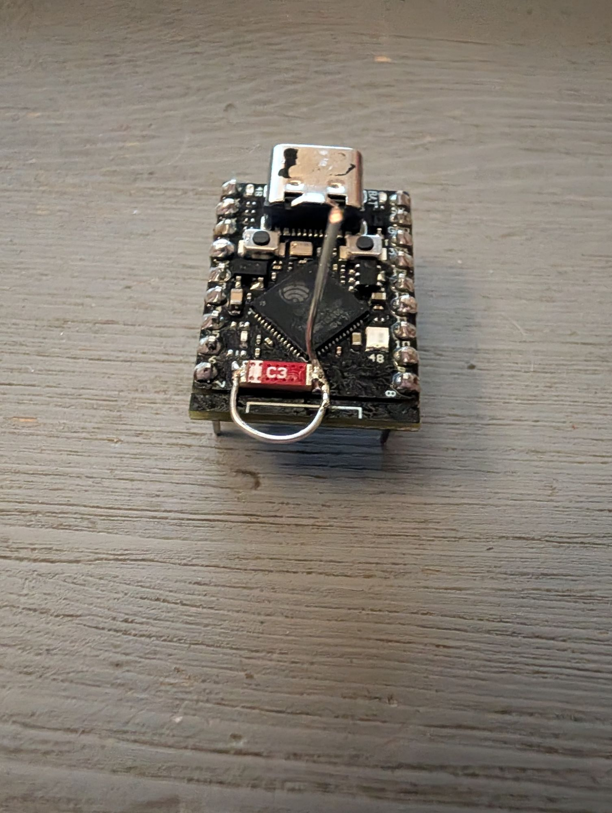

# Notes d'architecture et choix techniques - MeteoHubSensor

## 1. Pourquoi ESP-NOW ?

L'objectif principal de ce projet est de déporter l'acquisition météo dans le jardin ou sur un balcon sans créer de fragilité sur le réseau :

- **Indépendance vis-à-vis du réseau local** : Si la box internet plante, redémarre ou change de mot de passe, l'acquisition météo ne s'arrête pas une seule seconde.
- **Ultra-faible consommation** : L'association Wi-Fi complète (DHCP, négociation WPA2, échange de clés) prend généralement entre 1.5 et 3 secondes. Avec ESP-NOW, la trame est émise en moins de 15 millisecondes dès le réveil.
- **Simplicité opérationnelle** : Aucun serveur web ou pile réseau complexe sur la sonde extérieure.

---

## 2. Consommation et autonomie sur batterie

### Bilan de consommation estimé :
1. **Phase de mesure et émission** (durée ~60 ms) :
   - Réveil + initialisation I2C : ~20 ms @ 20 mA
   - Mesure AHT20/BMP280 : ~15 ms @ 5 mA
   - Émission radio ESP-NOW : ~15 ms @ 120 mA
   - Énergie par cycle : environ \(0.002 \text{ mAh}\) par mesure.

2. **Phase de veille profonde (Deep Sleep)** :
   - ESP32-S3 Super Mini en deep sleep : plus gourmand que le C3 (LDO + USB
     PHY). Compter quelques dizaines de µA, à mesurer sur la carte réelle.
   - S'ajoute le **pont de mesure batterie** (100k/100k sur le + accu) qui draine
     ~20 µA en continu. Négligeable ici, mais présent aussi pendant le deep sleep :
     pour le supprimer, on pourrait commander le pont par un GPIO (MOSFET) ; jugé
     inutile vu l'ordre de grandeur.

### Autonomie théorique :
- La cadence réelle est de **5 minutes** (`SENSOR_MEASUREMENT_INTERVAL_SECONDS`, configurable) : bien plus économe qu'une mesure par minute, l'essentiel du temps étant passé en deep sleep.
- Le nœud de prod actuel (S3 Super Mini + module régulateur 3,3 V Youmi + accu Li-ion ; 500 mAh au départ, **3000 mAh** depuis le 2026-10-03 ; deux accus à permuter, chargés dans un chargeur de bureau) tient plusieurs jours ; l'autonomie exacte reste à mesurer sur la carte réelle (le S3 dort moins efficacement que le C3 à cause du LDO et du PHY USB).
- Avec une cellule plus grosse (14500/18650) ou un petit panneau solaire + module de charge, le système peut viser une autonomie longue durée. Chiffres à confirmer par la mesure terrain, pas par le calcul seul.

---

## 3. Synchronisation du canal Wi-Fi

ESP-NOW n'existe que sur **le canal de l'AP** auquel MeteoHub est associé.

La sonde repère le canal grâce à l'AP `MH-NOW` du hub, puis envoie en unicast.
La MAC du hub vient de la NVS, écrite par l'appairage (appui long sur BOOT, voir
le README). Une fois appairée, la sonde cherche le BSSID exact de l'AP de SON
hub : plusieurs hubs peuvent cohabiter. `ESPNOW_RECEIVER_MAC` (`config.h`) vaut
zéro : sans appairage enregistré, la sonde n'envoie rien et attend un appui long.
Le statut local est la LED RGB et le moniteur série (plus d'OLED sur la sonde).

- Copier `include/secrets_example.h` vers `include/secrets.h` ici (ignoré par git).
- Si le SSID n'est pas vu : canal RTC, sinon repli `ESPNOW_WIFI_CHANNEL_FALLBACK`.
- Côté station, la page OLED **Net.** affiche canal STA et MAC : les deux doivent coller.

---

## 4. Évolution et extensibilité

Le protocole utilise un champ `valid_fields` (masque binaire 16 bits). Cela permet à MeteoHub S3 de savoir instantanément quelles données sont fiables et présentes :

- Si seule la sonde AHT20 est branchée : seuls les bits `FIELD_TEMPERATURE` et `FIELD_HUMIDITY` sont actifs.
- Lorsqu'un anémomètre est ajouté ultérieurement : le bit `FIELD_WIND_SPEED` est activé, et MeteoHub commence automatiquement à enregistrer et afficher le vent sans casser la compatibilité des anciennes trames.

---

## 5. Retour terrain : sonde de prod remplacée par une carte avec antenne filaire (2026-10-06)

**Info importante : matériel.** La sonde de prod est une **ESP32-S3 Super Mini N4R2** (4 Mo flash,
PSRAM 2 Mo quad). L'ancienne sonde (MAC 3C:0F:02:E2:C7:D4, vue du hub `E2:C7:D4`) et la nouvelle
(AC:27:6E:CC:B2:DC, vue du hub `CC:B2:DC`) sont **le même modèle de carte** : la comparaison ne
mélange pas deux puces. Le C3 (HW-675) n'existe que sur le banc, jamais en prod. Ne pas déduire
le modèle d'une MAC (le préfixe ne distingue pas S3 et C3).

**Attention au mot « C3 » : l'inscription « C3 » sur la puce céramique rouge de la carte est le
marquage de l'antenne céramique, commune aux Super Mini ESP32-C3 et ESP32-S3. Ce n'est pas le
SoC : une carte S3 porte bien ce « C3 » sur son antenne.**

- Nouvelle sonde : carte avec une antenne filaire ajoutée autour de l'antenne céramique. Fil rigide 20 AWG
  (0,5 mm), 35 mm au total : 15 mm en vertical, le reste forme la boucle autour des deux côtés de
  l'antenne céramique. Photo du montage : `docs/antenne-filaire-g2.jpg` (mesures faites avec le banc d'essai Wi-Fi). Géométrie très
  sensible : 1 mm de boucle a valu ~9 dB sur le banc.
- Banc Wi-Fi (même carte, même endroit) : RSSI moyen -53,2 dBm sans antenne, -42,2 avec la 1re
  géométrie (34 mm), -33,4 avec la 2e (35 mm), 0 % de perte dans tous les cas. Ces mesures
  démontrent une amélioration importante du RSSI, mais pas encore une augmentation mesurable de la
  fiabilité de la liaison : le taux de perte était déjà de 0 % sans antenne dans ces conditions
  de test.
- Appairage du 2026-10-06 à 00:37 : 5 demandes en ~1 s, réponse du hub canal 11, sonde associée ;
  1re trame vivante à 00:42, `seq=1` sans mesures valides (ignorée par le hub), `seq=2` et `3`
  valides, rattrapage complet (`want=0/0`). Réveil `up=2s`, comme l'ancienne sonde.
- **Référence à comparer** : dernière ligne ESP-NOW du hub avec l'ancienne sonde : `rx=107 ok=107
  bad=0 rssi=-37` (canal 11). Comparer avec la ligne `src=...CC:B2:DC` suivante.
- Impression (non chiffrée, observation subjective à confirmer par une mesure) : association Wi-Fi plus rapide qu'avec la carte nue.
- TX ESP-NOW toujours plafonnée à 11 dBm par le firmware (`SENSOR_NEEDS_TX_LIMIT`) : à pleine
  puissance le hub n'acquittait pas avec l'antenne PCB d'origine. Non retesté avec l'antenne
  filaire ; sur le banc, une des deux cartes ne s'associait pas à 19,5 dBm (avec ou sans fil),
  l'autre oui : le comportement à pleine puissance dépend de la carte individuelle.
- À suivre : RSSI/ACK vus par le hub, courbe de batterie du hub (>= 1.59.0), tenue du fil à la
  pluie et au vent.

**Sources de l'idée.** Fiche de la carte sur espboards.dev (encart « Good to know » : sur certaines
S3 Super Mini, l'antenne céramique est montée à l'envers, la piste d'alimentation ne touche alors
pas l'élément ; le point d'alimentation est du côté de la barre blanche) et l'article Hackaday
[Simple antenna makes for better ESP32-C3 WiFi](https://hackaday.com/2025/04/07/simple-antenna-makes-for-better-esp32-c3-wifi/)
(2025-04-07), qui décrit un fil quart d'onde de 31 mm. L'idée est cohérente avec une antenne quart d'onde à
2,4 GHz, soit environ 31 mm dans l'air. Le montage réellement retenu fait 35 mm de fil, mais sa
géométrie autour de l'antenne céramique fait partie intégrante du montage. Piste à vérifier si une carte
s'associe mal : l'orientation de l'antenne avant d'accuser la puce.

**Comment on en est arrivé là.** Aucune antenne n'était prévue. L'information est venue d'une
lecture sur espboards.dev, puis de l'article Hackaday : « quart d'onde, 2,4 GHz, environ 31 mm »
a rappelé les antennes de la CB. Un bout de fil 20 AWG a suivi, puis un banc d'essai Wi-Fi pour
vérifier que l'idée tenait.
